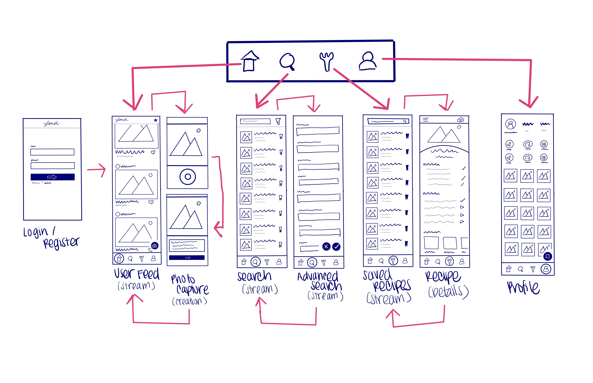

Unit 8: Group Milestone - README
===

# Fond

## Table of Contents
1. [Overview](#Overview)
1. [Product Spec](#Product-Spec)
1. [Wireframes](#Wireframes)

## Overview
### Description
Fond is a mobile application that allows hungry foodies and passionate chefs to find inspiration for their next dish while browsing their feed or searching for a recipe on the app to make. With ingredient search, aspiring chefs can use items already in the kitchen in new and exciting ways. Once concocted, users will be able share their food creations with the world. 

### Evaluation
- **Category:** Social Networking / Food

- **Mobile:** Mobile is essential for easy posting. Users will use their phone's built in camera to take photos and upload them to their feed. [Stretch] Users will be able to use their phone's camera to scan barcodes and easily upload ingredients, making recipe search even simpler. 
 
- **Story:** Allows users to answer the age-old question, "What's for dinner?" Users will be able to find inspiration and ways to cook ingredients that they already have, creating interest and cutting down on food waste. [stretch] Once they find new favorites, they'll be able to save them to their account for easy access and use. They'll also be able to "fond" posts and receive "fonds" on their own posts, for positive affimation. 
- **Market:** According to a 2012 Hartman Group study, half of consumers surveyed use social media to learn about food. There's a huge market, and Fond allows users to find recipes and inspiration from a single collective source. Ads for local restaurants or personal recipe blogs/vlogs could be used for monetization. 
- **Habit:** With endless scroll, and a large amount of user posts, the app could be very addictive to a user that has time to spare. An average user could use the app at the very least, once a week to plan dinner, but would return once a day to see new posts. An average user would not just consume posts, but would also create their own. 
- **Scope** Our most basic iteration of the app would include a post feed, allow users to upload photos of their own foods, and a recipe search with minimal search options (recipe name search and ingredient search). We believe that the most stripped down version of the app still provides a rich user experience and is also very attainable by the end of the program. Further iterations include allowing users to "fond" other posts, additional recipe filters, and additional user features (e.g. creating shopping lists from saved ingredients). 

## Product Spec

### 1. User Stories 

#### Required Must-have Stories  

* [ 1 ] User can register a new account
* [ 2 ] User can login
* [ 3 ] User sees app icon in home screen and styled bottom navigation view.
* [ 4 ] User can see a feed of recent user-generated photos
* [ 7 ] API returns a list of recipes that user make
* [ 8 ] User can take a picture of recipe they made
* [ 10 ] User can search for recipes based on title
* [ 13 ] User can filter search based on ingredients // The search results are unrelated to pantry. This is a simple, return of API data
* [ 23 ] User can see a personal feed of what they’ve posted

#### Optional Stories

* [ 31 ] Screen stays on (light doesn’t dim) while user has the recipe open
* [ 11 ] User can create a persisted list of ingredients 
* [ 5 ] User feed is filled with most popular recipes
* [ 6 ] User can see similar recipes to the one they selected on their feed
* [ 15 ] User can filter search based on including ingredients that are in their inventory of ingredients
* [ 18 ] User can filter search based on food genre (Italian, Mexican, etc)
* [ 24 ] User can like recipes
* [ 25 ] User can like others’ pictures of recipes
* [ 27 ] User can favorite recipes 
* [ 33 ] User is able to check off what has been completed when making the recipe 
* [ 35 ] User can see a history of recipes they’ve tried
* [ 36 ] User can save recipe lists for meal planning
* [ 37 ] User can click on a recipe ingredient to see what substitutes might work/have been used
* [ 39 ] User can see number of overall likes for each recipe post
* [ 42 ] User can pull up a conversion chart (i.e. 1 tbsp = 3 tsp)
* [ 14 ] User can filter search based on excluding ingredients 
* [ 16 ] User can filter search based on excluding ingredients that are in their profile settings
* [ 17 ] User can have a list of xx? recipes returned to them that maximize the ingredients they have on hand and minimize the ones they don’t
* [ 19 ] User can filter search based on food Cook time (40 minutes total time)
* [ 20 ] User can filter search based on appliances available / unavailable (air fryer, instapot, etc.)
* [ 21 ] User can filter search based on nutritional data
* [ 26 ] User can attach their own photo to a recipe [attaching a photo and attaching photo to a recipe are 2 different things to my mind]
* [ 29 ] User can save a list of currently available ingredients
* [ 32 ] Have a ‘table of contents’ sidebar a la Wikipedia’s mobile app (User’s reported getting lost w/in the recipe)
* [ 40 ] User can see number of likes for each recipe post from their foodie friends (i.e. vouching from ppl they know)
* [ 41 ] User can query recipes that do not use chosen kitchen equipment
* [ 43 ] Businesses can post ads 

#### Stretch Stories

* [ 12 ] User given option to select from a list of recommended staples to add to their inventory
* [ 22 ] User can filter recipes based on the food plan they are following (Paleo, Whole30, Gluten-free, Atkins, Keto, etc)
* [ 28 ] User can scale recipe based on number of people
* [ 30 ] User can build a shopping list with missing recipe ingredients
* [ 38 ] When a recipe says “do x for 15 minutes”, user can click on that to start a timer
* [ 44 ] User can see articles 
* [ 45 ] We deploy the app on the app store
* [ 34 ] User can find an ingredient based on barcode

### 2. Screen Archetypes 

#### Login Screen
* Required Stories
    * [ 2 ] User can login

#### Register Screen
* Required Stories
    * [ 1 ] User can register a new account

#### User Feed - Stream Screen
* Required Stories
    * [ 4 ] User can see a feed of recent user-generated photos

* Optional
    * [ 24 ] User can like recipes
    * [ 5 ] User feed is filled with most popular recipes
    * [ 25 ] User can like others’ pictures of recipes
    * [ 39 ] User can see number of overall likes for each recipe post
    * [ 40 ] User can see number of likes for each recipe post from their foodie friends (i.e. vouching from ppl they know)
    * [ 43 ] Businesses can post ads 

* Stretch
    * [ 44 ] User can see articles 

#### Search Screen - Stream Screen
* Required Stories
    * [ 7 ] API returns a list of recipes that user make
    * [ 10 ] User can search for recipes based on title

* Optional
    * [ 41 ] User can query recipes that do not use chosen kitchen equipment

#### Advanced Search - Stream Screen
* Required Stories
    * [ 13 ] User can filter search based on ingredients // The search results are unrelated to pantry. This is a simple, return of API data

* Optional
    * [ 15 ] User can filter search based on including ingredients that are in their inventory of ingredients
    * [ 18 ] User can filter search based on food genre (Italian, Mexican, etc)
    * [ 14 ] User can filter search based on excluding ingredients 
    * [ 16 ] User can filter search based on excluding ingredients that are in their profile settings
    * [ 17 ] User can have a list of xx? recipes returned to them that maximize the ingredients they have on hand and minimize the ones they don’t
    * [ 19 ] User can filter search based on food Cook time (40 minutes total time)
    * [ 20 ] User can filter search based on appliances available / unavailable (air fryer, instapot, etc.)
    * [ 21 ] User can filter search based on nutritional data

* Stretch
    * [ 22 ]	User can filter recipes based on the food plan they are following (Paleo, Whole30, Gluten-free, Atkins, Keto, etc)
    * [ 34 ] User can find an ingredient based on barcode

#### Recipe Screen - Detail Screen
* Required Stories
    * None
* Optional
    * [ 6 ] User can see similar recipes to the one they selected on their feed
    * [ 33 ] User is able to check off what has been completed when making the recipe 
    * [ 37 ] User can click on a recipe ingredient to see what substitutes might work/have been used
    * [ 42 ] User can pull up a conversion chart (i.e. 1 tbsp = 3 tsp) 
    * [ 26 ] User can attach their own photo to a recipe [attaching a photo and attaching photo to a recipe are 2 different things to my mind]
    * [ 32 ] Have a ‘table of contents’ sidebar a la Wikipedia’s mobile app (User’s reported getting lost w/in the recipe)
* Stretch
    * [ 28 ] User can scale recipe based on number of people
    * [ 30 ] User can build a shopping list with missing recipe ingredients
    * [ 38 ] When a recipe says “do x for 15 minutes”, user can click on that to start a timer

#### Recipe Screen - Saved Recipes Screen
* Required Stories
    * None
* Optional
    * [ 27 ] User can favorite recipes 

#### Creation Screen
* Required Stories
    * [ 8 ] User can take a picture of recipe they made

#### Profile Screen
* Required Stories
    * [ 23 ] User can see a personal feed of what they’ve posted

* Optional
    * [ 11 ] User can create a persisted list of ingredients 
    * [ 35 ] User can see a history of recipes they’ve tried
    * [ 36 ] User can save recipe lists for meal planning

* Stretch
    * [ 12 ] User given option to select from a list of recommended staples to add to their inventory 

#### Other (No screen involved)

* Required Stories
    * [ 3 ] User sees app icon in home screen and styled bottom navigation view.
 
* Optional 
    * [ 31 ] Screen stays on (light doesn’t dim) while user has the recipe open
 
* Stretch
    * [ 45 ] We deploy the app on the app store

### 3. Navigation 

#### Tab Navigation (Tab to Screen)

* Bottom Bar Navigation
    * User Feed - Stream Screen
    * Search Screen - Stream Screen
    * Saved Recipes Screen - Stream Screen
    * Profile Screen

* Top Bar Navigation
    * Creation Screen

#### Flow Navigation (Screen to Screen)

**Login Screen**
* -> User Feed

**Register Screen**
* -> User Feed

**User Feed - Stream Screen**
* -> None, but future version might go to the Recipe Screen by tapping an image

**Search Screen - Stream Screen**
* -> Advanced Search Screen
* -> Recipe Screen

**Advanced Search - Stream Screen**
* -> Recipe Screen

**Saved Recipe Screen - Stream Screen**
* -> Recipe Screen

**Recipe Screen**
* -> Creation Screen

**Creation Screen**
* -> Profile Screen (for now because the personal feed is a required story)
* -> Future versions may go to the User Feed (if we integrate stretch stories with the User Feed)

**Profile Screen**
* -> None
* -> Future versions may go to the Search Screen (If we maintain a persistent list of ingredients)
*# Product Spec

## Wireframes

